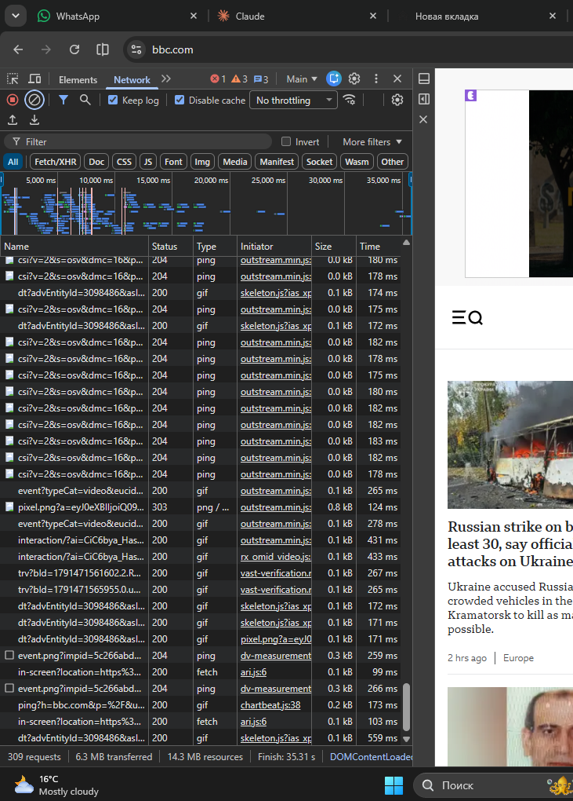
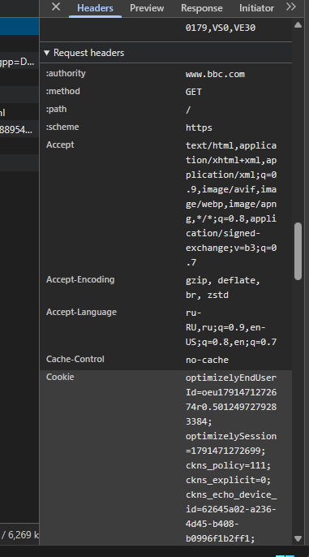
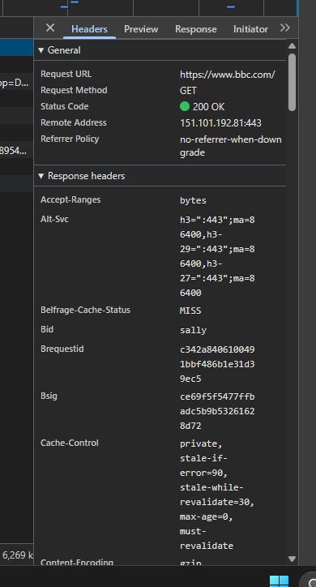
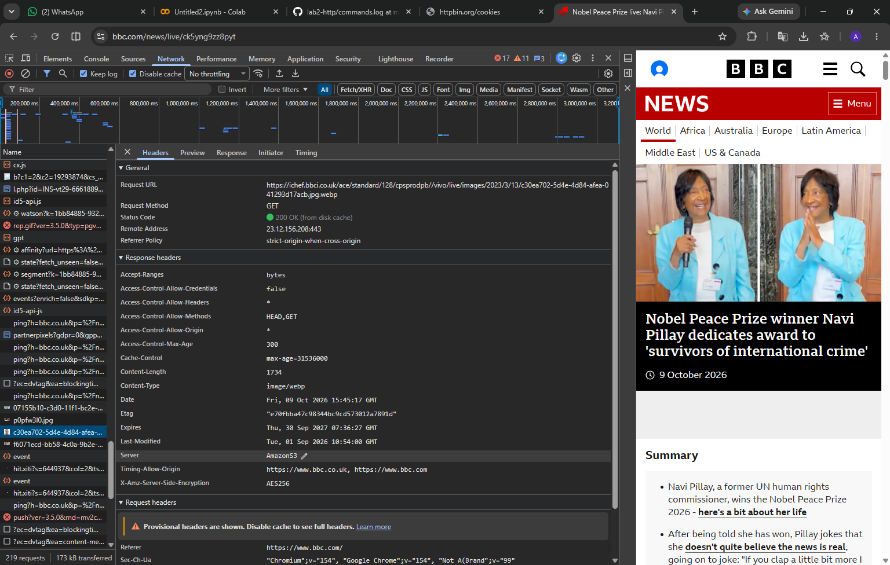
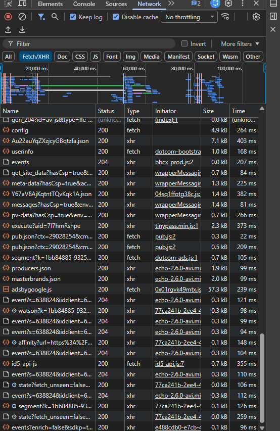

# Лабораторная работа №2. Исследование HTTP-запросов и ответов

Студент: Akyl Momunov
Дата: 10.10.2026

## Задание A. Адреса, DNS и URL

### A1. DNS для example.com

Команда: nslookup example.com

DNS-сервер: 192.168.0.1 (роутер).

Адреса: 2606:4700:10::6814:179a, 2606:4700:10::ac42:93f3 (IPv6),

104.20.23.154, 172.66.147.243 (IPv4).

Вывод: DNS переводит имя сайта в IP-адрес, потому что для соединения

с сервером браузеру нужен именно адрес, а не имя.

### A2. Сравнение с google.com

Команда: nslookup google.com

Адреса: 4 IPv6 (2a00:1450:4001:c0f::...) и 6 IPv4 (142.251.14.100 и др.).

У example.com 4 адреса (2 IPv6 + 2 IPv4), у google.com 10 (4 IPv6 + 6 IPv4).

Вывод: у обоих сайтов есть IPv4 и IPv6. Крупному сайту нужно несколько

адресов, чтобы распределять нагрузку между серверами и продолжать

работать при отказе одного из них.

### A3. ping

Команда: ping -n 4 example.com

Результат: отправлено 4, получено 4, потеряно 0 (0% потерь),

время ответа min 5 мс, max 7 мс, среднее 6 мс.

Вывод: сервер отвечает быстро и стабильно, вероятно, он расположен

близко (сайт работает через CDN).

### A4. tracert

Команда: tracert example.com

Результат: 7 прыжков: домашний роутер, сеть провайдера (aknet.kg),

узел обмена в Бишкеке (elcat.kg), внешняя сеть, сервер 104.20.23.154.

Времена на всех прыжках 1-11 мс, резкого роста задержки нет.

Вывод: маршрут короткий, сервер находится недалеко; пик 11 мс на

5-м прыжке единичный.

### A5. Разбор адреса

https://user@uni.example:8443/api/v1/students/42?group=IS-21\&sort=asc#grades

\- схема: https

\- пользователь: user

\- хост: uni.example

\- порт: 8443

\- путь: /api/v1/students/42

\- параметры запроса: group=IS-21\&sort=asc

\- фрагмент: grades

### A6. Порты

Стандартные порты: HTTP 80, HTTPS 443. Чтобы открыть сайт на нестандартном

порту (например, 8443), порт указывают в адресе после имени хоста через

двоеточие: https://uni.example:8443/. За это отвечает часть адреса port.

## Задание B. Анализ запросов в DevTools

### B1. Общая картина (bbc.com)

Число запросов: 328

Передано: 6.3 MB (ресурсов 14.3 MB)

Время загрузки (Finish): 35.31 с

Больше всего запросов типа: ping, затем gif.

Вывод: это аналитика и рекламные трекеры. Сама страница весит

немного, но к сторонним серверам идёт очень много мелких запросов.

Скриншот: screenshots/b1-overview.png

### B2-B3. Запрос 1: Document

URL: https://www.bbc.com/

Метод: GET

Статус: 200 OK

Remote Address: 151.101.192.81:443

Заголовки запроса:

\- :authority: www.bbc.com

\- Accept: text/html,application/xhtml+xml,...

\- Accept-Language: ru-RU,ru;q=0.9,en-US;q=0.8,en;q=0.7

\- Accept-Encoding: gzip, deflate, br, zstd

Заголовки ответа:

\- Cache-Control: private, stale-if-error=90, stale-while-revalidate=30, max-age=0, must-revalidate

\- Content-Encoding: gzip

\- Accept-Ranges: bytes

\- Alt-Svc: h3=":443" (сервер предлагает HTTP/3)

Cookies (только имена): optimizelyEndUserId, optimizelySession,

ckns_policy, ckns_explicit, ckns_echo_device_id

Тело запроса: нет (GET)

Тело ответа: HTML-код страницы (проверить на вкладке Response)

Скриншот: screenshots/b2-doc.png

### Запрос 2: ресурс (изображение)

URL: https://ichef.bbci.co.uk/news/320/cpsprodpb/0a5b/live/25d71060-c2fa-11f1-b8c6-6d610e41a5d9.jpg.webp

Метод: GET

Статус: 200 OK

Remote Address: 184.24.144.174:443

Заголовки запроса:

\- :authority: ichef.bbci.co.uk

\- Accept: image/avif,image/webp,image/apng,image/svg+xml,image/*,*/*;q=0.8

\- Accept-Encoding: gzip, deflate, br, zstd

\- Referer: https://www.bbc.com/

Заголовки ответа:

\- Content-Type: image/webp

\- Content-Length: 11320

\- Cache-Control: max-age=31536000

\- Access-Control-Allow-Origin: *

Cookies: нет (запрос к другому домену, вкладка Cookies пуста)

Тело запроса: нет (GET)

Тело ответа: изображение WebP, около 11 kB (видно на вкладке Preview)

Скриншот: screenshots/b2-resource.png

### Запрос 3: Fetch/XHR

URL: https://stats-collector.cxense.com/cr-stats/event/in-screen?location=... (длинная строка параметров сокращена)

Метод: GET

Статус: 200 OK

Remote Address: 167.235.124.24:443

Заголовки запроса:

\- :authority: stats-collector.cxense.com

\- :method: GET

\- :path: /cr-stats/event/in-screen?...

\- ... (добавьте ещё 1-2)

Заголовки ответа:

\- Content-Type: image/gif

\- Content-Length: 42

\- Access-Control-Allow-Origin: *

\- Server: Jetty(...)

Cookies: ... (только имена, или «нет»)

Тело запроса: нет (GET); данные передаются в параметрах адреса (location, pId, ...)

Тело ответа: GIF-пиксель размером 42 байта (трекер, посещение страницы)

Скриншот: screenshots/b2-xhr.png

### B4. Протокол и Timing

Встретились версии: h2 и h3.

Самая долгая стадия в Timing: 232

### B5. Самый тяжёлый и самый медленный

Самый тяжёлый запрос: ... (имя), 354 kB

Самый медленный запрос: ... (имя), 442 мс

Вывод: «самый тяжёлый и самый медленный запросы не совпали, потому что время зависит не только от размера, но и от того, как быстро отвечает сервер».

### B6. Сводная таблица

| Поле | Запрос 1 (Document) | Запрос 2 (ресурс) | Запрос 3 (Fetch/XHR) |
|---|---|---|---|
| Request URL | https://www.bbc.com/ | https://ichef.bbci.co.uk/news/320/.../25d71060-...jpg.webp | https://stats-collector.cxense.com/cr-stats/event/in-screen?... |
| Method | GET | GET | GET |
| Status code | 200 OK | 200 OK | 200 OK |
| Заголовки запроса (3+) | :authority, Accept, Accept-Language, Accept-Encoding | :authority, Accept, Accept-Encoding, Referer | :authority, :method, :path |
| Заголовки ответа (3+) | Cache-Control, Content-Encoding, Accept-Ranges | Content-Type, Content-Length, Cache-Control | Content-Type, Content-Length, Access-Control-Allow-Origin |
| Cookies | optimizelyEndUserId, optimizelySession, ckns_policy, ckns_explicit, ckns_echo_device_id | нет | (впишите из вкладки Cookies) |
| Тело запроса | нет | нет | нет |
| Тело ответа | HTML страницы | изображение WebP (~11 kB) | GIF-пиксель (42 байта) |

## Задание C. Методы HTTP и статус-коды

Примечание: при первом запуске команда без ключа -4 завершилась ошибкой

curl: (28) Failed to connect to jsonplaceholder.typicode.com:443 after 21300 ms.

Сервис отвечал нестабильно, поэтому дальше используется ключ -4 (только IPv4).

Диагностика: example.com и httpbin.org в это время отвечали (200 OK).

### C1. GET одного ресурса

Команда: curl -4 -i https://jsonplaceholder.typicode.com/posts/1

Статус: 200 OK

Заголовки: Content-Type: application/json; charset=utf-8; Content-Length: 292;

Cache-Control: max-age=43200

Тело: JSON одного поста (userId: 1, id: 1, title, body)

Вывод: сервер вернул запрошенный ресурс в формате JSON.

Скриншот: screenshots/c1-get.png

### C2. GET с параметром запроса

Команда: curl -4 -i "https://jsonplaceholder.typicode.com/posts?userId=1"

Статус: 200 OK

Заголовки: Content-Type: application/json; charset=utf-8;

Transfer-Encoding: chunked; Cache-Control: max-age=43200

Тело: JSON-массив постов только пользователя с userId=1 ([10] шт.)

Вывод: параметр запроса после ? отфильтровал список. В отличие от C1

вернулся массив, а не один объект, а размер не указан (chunked).

### C3. GET несуществующего ресурса

Команда: curl -4 -i https://jsonplaceholder.typicode.com/posts/9999

Статус: 404 Not Found

Заголовки: Content-Type: application/json; charset=utf-8; Content-Length: 2;

Cache-Control: max-age=43200

Тело: {} (пустой JSON-объект)

Вывод: поста с id 9999 нет, сервер вернул код 4xx, то есть ошибка на

стороне клиента (запрошен несуществующий адрес), а не сбой сервера.

### C4. POST: создание ресурса

Команда: curl -4 -i -X POST -H "Content-Type: application/json" -d @post.json https://jsonplaceholder.typicode.com/posts

Статус: 201 Created

Заголовки: Location: https://jsonplaceholder.typicode.com/posts/101;

Content-Type: application/json; charset=utf-8; Content-Length: 68;

Cache-Control: no-cache

Тело: отправленный JSON (title, body, userId) с добавленным id: 101

Вывод: сервер создал ресурс и вернул 201 с адресом нового ресурса в Location.

Скриншот: screenshots/c4-post.png

### C5. PUT: замена ресурса

Команда: curl -4 -i -X PUT -H "Content-Type: application/json" -d @put.json https://jsonplaceholder.typicode.com/posts/1

Статус: 200 OK

Заголовки: Content-Type: application/json; charset=utf-8; Content-Length: 64;

Cache-Control: no-cache

Тело: {"id":1,"title":"New","body":"Text","userId":1} (ровно то, что отправлено)

Вывод: ресурс заменён целиком новым содержимым.

### C6. PATCH: частичное изменение

Команда: curl -4 -i -X PATCH -H "Content-Type: application/json" -d @patch.json https://jsonplaceholder.typicode.com/posts/1

Статус: 200 OK

Заголовки: Content-Type: application/json; charset=utf-8; Content-Length: 225;

Cache-Control: no-cache

Тело: title стал "Updated", остальные поля (userId, id, body) сохранились

Вывод: изменено только присланное поле.

### C7. DELETE: удаление ресурса

Команда: curl -4 -i -X DELETE https://jsonplaceholder.typicode.com/posts/1

Статус: 200 OK

Заголовки: Content-Type: application/json; charset=utf-8; Content-Length: 2;

Cache-Control: no-cache

Тело: {} (пустой объект)

Повторный GET (C1) после удаления: 200 OK, пост на месте.

Вывод: сервис тестовый, данные не изменяет. На настоящем API повторный

запрос вернул бы 404 Not Found.

### C8. Перенаправление

Команда 1: curl -4 -i https://httpbin.org/redirect/1

Статус: [302 FOUND]

Заголовки: Location: /get; Content-Type: text/html; charset=utf-8; Content-Length: 215

Тело: HTML с текстом о перенаправлении

Команда 2: curl -4 -iL https://httpbin.org/redirect/1

Результат: первый ответ с Location: /get, затем curl сам перешёл на /get

и получил 200 OK, application/json, Content-Length: 256, тело с "url": "https://httpbin.org/get".

Вывод: адрес перенаправления находится в заголовке Location. Без -L curl

останавливается на первом ответе, с -L переходит по нему автоматически.

Скриншот: screenshots/c8-redirect.png

### C9. Разные статус-коды

Команда 1: curl -4 -i https://httpbin.org/status/418

Статус: 418 I'M A TEAPOT

Заголовки: Content-Length: 135; Server: gunicorn/19.9.0;

x-more-info: http://tools.ietf.org/html/rfc2324

Тело: ASCII-рисунок чайника

Команда 2: curl -4 -i https://httpbin.org/status/500

Статус: 500 INTERNAL SERVER ERROR

Заголовки: Content-Type: text/html; charset=utf-8; Content-Length: 0;

Server: gunicorn/19.9.0

Тело: пустое

Ответы на вопросы

1. PUT и PATCH. В C5 (PUT) в ответе пришёл объект ровно из отправленных

полей, прежний body заменён. В C6 (PATCH) изменился только title, остальные

поля остались. PUT используют для полной замены ресурса, PATCH для

изменения отдельных полей.

2. Код C4: 201 Created. Он сообщает не просто об успехе (200), а о том,

что на сервере создан новый ресурс; адрес нового ресурса пришёл в

заголовке Location (/posts/101).

3. После C7 (DELETE) повторный C1 вернул 200 и пост на месте, потому что

тестовый сервис только имитирует API и ничего не сохраняет. Настоящий API

после удаления вернул бы 404 Not Found.

4. C8: без -L ответ 302 FOUND с заголовком Location: /get, curl остановился.

С -L curl перешёл по Location и получил 200 OK с JSON.

5. Код 418 относится к классу 4xx (вина клиента, сделавшего такой запрос),

500 к классу 5xx (вина сервера, который не смог выполнить запрос).

6. POST не идемпотентен: каждый повтор создаёт новый ресурс. Если связь

оборвалась и пользователь нажал «Оформить заказ» ещё раз, могут создаться

два одинаковых заказа.

## Задание D. Заголовки и cookies

### D1. Что отправляет клиент

Команда: curl -4 -i https://httpbin.org/headers

Заголовки curl: Accept: */*, Host: httpbin.org, User-Agent: curl/8.21.0,

X-Amzn-Trace-Id (добавляет инфраструктура сервера).

Заголовки браузера (httpbin.org/headers в Chrome): 16 заголовков, среди них

Accept (список форматов), Accept-Language: ru-RU,ru;q=0.9,...,

Accept-Encoding: gzip, deflate, br, zstd, Sec-Ch-Ua*, Sec-Fetch-*,

Upgrade-Insecure-Requests, Priority.

User-Agent: у curl curl/8.21.0, у браузера Mozilla/5.0 (Windows NT 10.0; ...)

Chrome/154.0.0.0 Safari/537.36.

Вывод: curl отправляет минимум заголовков, а браузер добавляет язык,

поддерживаемые форматы и служебные данные. User-Agent нужен серверу, чтобы

знать тип клиента: например, отдать подходящую версию страницы или вести

статистику.

Скриншот: screenshots/d1-browser-headers.png

### D2. Cookie и её путь

Адрес: https://httpbin.org/cookies/set?course=http\&student=test

Запрос 1 (/cookies/set...): статус 302 Found; в ответе Location: /cookies и два

заголовка Set-Cookie: course=http; Path=/ и student=test; Path=/.

Запрос 2 (/cookies): статус 200 OK; в запросе заголовок Cookie: course=http; student=test;

в теле ответа JSON с теми же cookies.

Связь: сервер в первом ответе велел браузеру сохранить cookies (Set-Cookie) и

перейти на другой адрес (Location). Браузер выполнил обе команды и приложил

cookies ко второму запросу (Cookie).

Скриншоты: screenshots/d2-set-cookie.png, screenshots/d2-cookie.png

### D3. Cookie в браузере (Application → Cookies → httpbin.org)

| Имя | Значение | Path | Expires / Max-Age | HttpOnly | Secure | SameSite |

|---|---|---|---|---|---|---|

| course | http | / | Session (срока нет) | нет | нет | не задан |

| student | test | / | Session (срока нет) | нет | нет | не задан |

Вывод: у обеих cookie нет Expires/Max-Age, поэтому это сеансовые cookies:

после закрытия браузера они будут удалены. Атрибуты HttpOnly, Secure и

SameSite не заданы, поэтому cookie доступна JavaScript, передаётся и по HTTP

и отправляется при межсайтовых запросах. Для настоящих cookies с данными

пользователя так делать небезопасно.

Скриншот: screenshots/d3-cookies.png

### D4. Cookies в curl

Команда 1: curl -4 -i -c jar.txt "https://httpbin.org/cookies/set?course=http"

Ответ: 302 FOUND, Set-Cookie: course=http; Path=/, Location: /cookies.

Файл jar.txt: строка "httpbin.org FALSE / FALSE 0 course http" (имя course,

значение http, Path /, срока жизни нет).

Команда 2: curl -4 -i https://httpbin.org/cookies -> {"cookies": {}} (пусто)

Команда 3: curl -4 -i -b jar.txt https://httpbin.org/cookies -> {"cookies": {"course": "http"}}

Вывод: без -b curl не отправляет cookie, сервер видит пустой список; с -b

curl добавляет cookie из файла, и сервер её видит. Это показывает, что HTTP

не хранит состояние клиента между запросами: «память» обеспечивается тем,

что клиент сам возвращает cookie при каждом запросе.

Скриншот: screenshots/d4-curl-cookies.png

### D5. Заголовок ответа

Команда: curl -4 -i "https://httpbin.org/response-headers?X-Course=HTTP"

Статус: 200 OK

Заголовок X-Course найден: X-Course: HTTP

Тело: JSON {"Content-Length": "91", "Content-Type": "application/json", "X-Course": "HTTP"}

Объяснение: сервис прочитал параметр запроса X-Course=HTTP из адреса и

добавил его как заголовок ответа. Сервер может формировать ответ по данным

запроса.

## Задание E. HTTPS и кэширование

### E1. Сертификат HTTPS (vocatype.app)

Выдан для: vocatype.app

Издатель: WE1 (Google Trust Services)

Срок действия: с 28.08.2026 по 26.11.2026

Что будет при истёкшем сертификате: браузер перестанет ему доверять и покажет

предупреждение о небезопасном соединении (ERR_CERT_DATE_INVALID), потому что

не сможет подтвердить, что сайт тот, за кого себя выдаёт.

Скриншот: screenshots/e1-certificate.png

### E2. Сравнение HTTP и HTTPS

Команды: curl -4 -i http://httpbin.org/get; curl -4 -i https://httpbin.org/get;

curl -4 -v https://httpbin.org/get

Результат: оба запроса дали 200 OK и одинаковое по смыслу тело (args, headers,

origin). Отличается только поле url (http:// / https://), поэтому Content-Length

255 и 256.

В подробном режиме для HTTPS видны строки о TLS-соединении: schannel (Windows),

ALPN (curl offers http/1.1, server accepted http/1.1), соединение на порт 443.

Для HTTP таких строк нет.

Риск: по HTTP пароль передаётся открытым текстом, его может прочитать любой

узел на пути (например, в публичном Wi-Fi). HTTPS шифрует данные и

подтверждает подлинность сервера сертификатом.

В выводе curl -v строк с текстом TLS/certificate нет (curl на Windows использует

Schannel и не печатает детали рукопожатия), но видны признаки TLS: соединение

на порт 443, строки schannel и ALPN. Сертификат разобран в E1 через браузер.

schannel: remote party requests renegotiation, renegotiating SSL/TLS connection, SSL/TLS connection renegotiated

Скриншот: screenshots/e2-http-https.png

### E3. Кэш браузера

Сайт: bbc.com (Disable cache снят, страница обновлена F5). Итог: 180 запросов,

123 kB передано (многое из кэша).

Ресурс: bundle-component-tabs....js

Статус: 200 OK (from disk cache)

Заголовки ответа: Cache-Control: max-age=31536000, public, immutable;

ETag: "14d6405540dbd6be09726381eee1669a";

Last-Modified: Fri, 09 Oct 2026 11:39:23 GMT

Вывод: браузер не скачал файл заново, а взял копию с диска. Срок актуальности

копии (1 год) браузер узнаёт из заголовка Cache-Control (max-age), который

отправил сервер.

Скриншот: screenshots/e3-cache.png

### E4. Условный запрос

Ресурс: https://ichef.bbci.co.uk/news/320/cpsprodpb/0a5b/live/25d71060-c2fa-11f1-b8c6-6d610e41a5d9.jpg.webp

Команда 1: curl -4 -I "<адрес>" -> 200 OK; ETag: "696d7430bffb052b8cbe228b33f5b867";

Content-Length: 11320; Last-Modified: Thu, 08 Oct 2026 10:16:34 GMT;

Cache-Control: max-age=31536000

Команда 2: curl -4 -I -H @h2.txt "<адрес>" (в h2.txt: If-None-Match: "696d7430bffb052b8cbe228b33f5b867")

\-> 304 Not Modified, без тела (в ответе нет Content-Length).

Вывод: сервер сравнил ETag клиента со своим, они совпали, и он ответил 304,

не пересылая файл. Это выгодно: клиент использует свою копию, экономятся

трафик и время загрузки, снижается нагрузка на сервер.

Примечание: для JS-файла bundle-component-tabs...js (static.files.bbci.co.uk)

тот же приём дал 200 OK: не все ресурсы поддерживают условные запросы; заголовок

If-None-Match при этом был отправлен корректно (проверено curl -v).

Скриншот: screenshots/e4-304.png

## Задание F. Анализ готовых HTTP-сообщений

### F1. Разбор запроса и ответа (POST /api/login)

1. Метод POST, путь /api/login, версия HTTP/1.1. Клиент отправляет данные для

входа (логин и пароль), то есть выполняет аутентификацию.

2. Content-Type: application/json (тело в формате JSON), Content-Length: 48

(размер тела в байтах), Accept: application/json (клиент хочет получить JSON).

3. Код 200 OK: вход выполнен успешно. В теле ответа {"id":42,"role":"STUDENT"}:

идентификатор пользователя и его роль.

4. Set-Cookie: session=abc123 (имя и значение cookie); HttpOnly (недоступна

JavaScript, защита от кражи через XSS); Secure (передаётся только по HTTPS);

SameSite=Lax (ограничивает отправку при межсайтовых запросах, защита от CSRF);

Max-Age=3600 (cookie живёт 3600 секунд, то есть 1 час).

5. GET /api/students/42 HTTP/1.1, Host: uni.example, Accept: application/json,

Cookie: session=abc123. Заголовок Cookie позволяет серверу узнать студента.

6. Cache-Control: no-store запрещает кэшировать ответ. Для данных конкретного

пользователя это разумно: их не должны сохранить общие кэши и показать другим.

7. По HTTP пароль идёт открытым текстом, и его может перехватить любой узел на

пути. HTTPS шифрует трафик.

### F2. Статус-коды

| № | Ситуация | Код и обоснование |

|---|---|---|

| 1 | Студент получил свой профиль | 200 OK: успех, ресурс возвращён |

| 2 | Создан новый студент | 201 Created: успех, создан новый ресурс |

| 3 | Студент удалён, тела нет | 204 No Content: успех без тела |

| 4 | /students навсегда перенесён | 301 Moved Permanently: постоянное перенаправление |

| 5 | Некорректный JSON (синтаксис) | 400 Bad Request: запрос синтаксически неверен |

| 6 | Нет токена | 401 Unauthorized: клиент не аутентифицирован |

| 7 | Студент открывает страницу админа | 403 Forbidden: вошёл, но прав нет |

| 8 | Студента 9999 нет | 404 Not Found: ресурса не существует |

| 9 | Email уже зарегистрирован | 409 Conflict: конфликт с текущим состоянием |

| 10 | JSON верен, но оценка 150 | 422 Unprocessable Content: данные не проходят проверку (допустимо 400) |

| 11 | Слишком много запросов | 429 Too Many Requests |

| 12 | Необработанное исключение в коде | 500 Internal Server Error |

| 13 | Proxy не связался с backend | 502 Bad Gateway |

| 14 | Ресурс не менялся с прошлой загрузки | 304 Not Modified: условный запрос, берётся кэш |

### F3. Напишите HTTP-запросы (API https://uni.example)

1. Получить студента 42 в формате JSON:

GET /api/students/42 HTTP/1.1

Host: uni.example

Accept: application/json

2. Создать студента Anna Ivanova, группа IS-21:

POST /api/students HTTP/1.1

Host: uni.example

Content-Type: application/json

{"firstName":"Anna","lastName":"Ivanova","group":"IS-21"}

3. Заменить данные студента 42 целиком:

PUT /api/students/42 HTTP/1.1

Host: uni.example

Content-Type: application/json

{"firstName":"Anna","lastName":"Ivanova","group":"IS-21"}

4. Изменить только группу студента 42 на IS-22:

PATCH /api/students/42 HTTP/1.1

Host: uni.example

Content-Type: application/json

{"group":"IS-22"}

5. Удалить студента 42:

DELETE /api/students/42 HTTP/1.1

Host: uni.example

6. Вторая страница списка студентов группы IS-21 по 20 на странице:

GET /api/students?group=IS-21\&page=2\&limit=20 HTTP/1.1

Host: uni.example

Accept: application/json

### F4. Диагностика

| № | Симптом | Стадия и проверка |

|---|---|---|

| 1 | ERR_NAME_NOT_RESOLVED | DNS: имя не превратилось в IP. Проверить, нет ли опечатки в адресе, работает ли интернет и DNS (nslookup) |

| 2 | localhost:3000, ERR_CONNECTION_REFUSED | Сеть/сервер: на порту никто не слушает. Проверить, запущен ли сервер и на каком порту |

| 3 | 401, нет заголовка Authorization | Клиент: токен не отправлен. Проверить, что клиент добавляет Authorization (вход выполнен, токен сохранён и подставляется) |

| 4 | 404 на /api/student/42 вместо /api/students/42 | Запрос клиента: опечатка в пути. Сверить адрес с документацией (students во множественном числе) |

| 5 | 200, интерфейс пуст; тело {"data":[...]}, код читает response.items | Frontend: ответ верный, код читает не то поле. Исправить на response.data |

| 6 | 500, в теле исключение об обращении к undefined | Backend: ошибка в коде сервера. Посмотреть логи сервера и стек вызовов, найти место, где используется undefined |

| 7 | Запрос красный, в консоли ошибка CORS | Политика браузера: сервер не разрешил запросы с этого источника. Проверить заголовки ответа сервера (Access-Control-Allow-Origin) и настройки CORS на backend |

### F5. Вопрос на размышление

1. Клиент не знает, обработал ли сервер запрос: заказ мог быть создан, а ответ

потерялся по пути, или запрос до сервера не дошёл.

2. Если повторить, а заказ уже создан, получится дубликат (два заказа, двойное

списание), потому что POST не идемпотентен.

3. Если не повторять, а заказа нет, клиент останется без заказа.

4. Решение: приложить к запросу уникальный идентификатор операции (например,

заголовок Idempotency-Key). Сервер запомнит ключ и при повторе вернёт результат

первого запроса, не создавая новый заказ. Дополнительно клиент может сначала

проверить, создан ли заказ (GET), и использовать идемпотентные методы

(например, PUT на заранее известный адрес ресурса).

